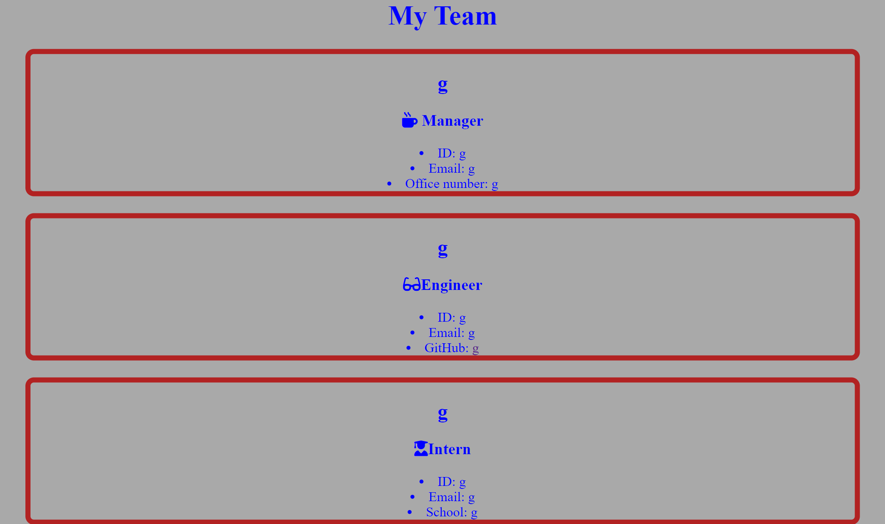

# Team management
  ## Table of Contents
  ### *[description](#description)
  ### *[Installation](#install)
  ### *[Usage](#usage)
  ### *[License](#license)
  ### *[Contributing](#Contributing)
  ### *[Tests](#tests)
  ### *[Questions](#questions)

  ## description:
  This app allows you to make a team of people and give them followable links to their contacts and what they do.
  ## Installation:
  go to github and open it in my repository
  ## visuals:

  ## Usage
  the use of this app is to make it easy for people to add people to their team of engineers or management or interns
  ## License
  N/A
  ## Contributing
  Grant Finnie
  ## Tests
  run node index.js in the terminal
  ## Questions
  ### github: gfinnie01
  ### Email: *grantfinnie0@gmail.com